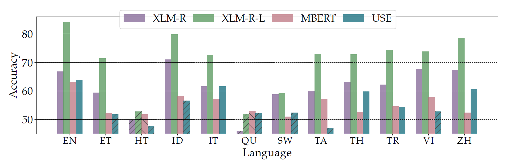

# XCOPA: A Multilingual Dataset for Causal Commonsense Reasoning

The Cross-lingual Choice of Plausible Alternatives dataset is a benchmark to evaluate the ability of machine learning models to transfer commonsense reasoning across languages. The dataset is the translation and reannotation of the English [**COPA**](https://people.ict.usc.edu/~gordon/copa.html) ([**Roemmele et al. 2011**](#cite)) and covers 11 languages from 11 families and several areas around the globe. The dataset is challenging as it requires both the command of world knowledge and the ability to generalise to new languages. All the details about the creation of XCOPA and the implementation of the baselines are available in the [**paper**](#).

[**Languages**](#languages) | [**Baselines**](#baselines) | [**Cite**](#cite) | [**Paper**](https://ducdauge.github.io/files/xcopa.pdf)

## Data

The XCOPA data are stored in [data](data). Alternatively, they can be loaded through [🤗Datasets](https://github.com/huggingface/datasets) as follows:

```python
from datasets import load_dataset

xcopa_dataset = load_dataset('xcopa')
```


The "translate test" data obtained via Google Translate are available in the folder [data-gmt](data-gmt) (note that these do not include Quechua).


## Examples

| Language | Premise | Question | Choice 1 | Choice 2 |
|---|---|---|---|---|
| qu | Sipasqa cereal mikhunanpi kuruta tarirqan. | Result | Payqa pukunman ñuqñuta churakurqan. | Payqa manam mikhuyta munarqanchu. |
| en | The girl found a bug in her cereal. | Result | She poured milk in the bowl. |She lost her appetite. |
| th | ตาของฉันแดงและบวม | Cause | ฉันร้องไห้ | ฉันหัวเราะ |
| en | My eyes became red and puffy. | Cause | I was sobbing. | I was laughing. |

## Languages

| ISO 639-2 | Name | Family | Area<sup>1</sup> |
|---|---|---|---|
| et | Estonian | Uralic | Northern Europe |
| ht | Haitian Creole | French Creole | Carribean |
| id | Indonesian | Austronesian | Southeastern Asia |
| it | Italian | Indo-European | Southern Europe |
| qu | Southern Quechua<sup>2</sup> | Quechuan | Southern America |
| sw | Swahili | Niger-Congo | Eastern Africa |
| ta | Tamil | Dravidian | Southern Asia |
| th | Thai | Kra-Dai | Southeastern Asia |
| tr | Turkish | Turkic | Western Asia |
| vi | Vietnamese | Austroasiatic | Southeastern Asia |
| zh | Mandarin Chinese | Sino-Tibetan | Eastern Asia |

<sup>1</sup> According to the United Nations geoscheme.

<sup>2</sup> Translation by [Irma Alvarez Ccoscco](https://es.wikipedia.org/wiki/Irma_Alvarez_Ccoscco), an Eastern Apurímac Quechua speaker.

## Leaderboard

If you want to see your results reported, please:

1) submit them on the [XCOPA state-of-the-art page on Papers with Code](https://paperswithcode.com/sota/cross-lingual-transfer-on-xcopa);
2) make a pull request changing the table below.

| Model | Paper | *avg* | et | ht | id | it | qu | sw | ta | th | tr | vi | zh |
|---|---|---|---|---|---|---|---|---|---|---|---|---| ---|
| Human | [Ponti et al. (2020)](https://ducdauge.github.io/files/xcopa.pdf) | 97.60 | 98.2 | 96.4 | 100.0 | 97.0 | 94.8 | 99.0 | 98.6 | 98.2 | 96.4 | 98.4 | 96.6 |
| RoBERTa Large (Translate test)| [Ponti et al. (2020)](https://ducdauge.github.io/files/xcopa.pdf) | 76.05 | 81.0 | 73.8 | 82.2 | 77.8 | (50.0) | 74.2 | 79.6 | 71.4 | 79.6 | 81.0 | 86.0 |
| XLM-R Large | [Ponti et al. (2020)](https://ducdauge.github.io/files/xcopa.pdf) | 68.69 | 71.4 | (50.0) | 79.8 | 72.6 | (50.0) | 59.2 | 73.0 | 72.8 | 74.4 | 73.8 | 78.6 |
| MAD-X Base | [Pfeiffer et al. (2020)](https://arxiv.org/pdf/2005.00052.pdf) | 60.94 | 61.3 |53.7 | 65.8 | 63.0 | 52.5 | 56.3 | 61.9 | 61.8 | 60.3 | 66.1 | 67.6 |

The performance of other multilingual pre-trained encoders is shown in the figure.


## Cite

If you use the data from this repository, please cite both XCOPA ```\cite{ponti2020xcopa}``` and the original COPA paper ```\cite{roemmele2011choice}```.

```
@inproceedings{ponti2020xcopa,
  title={{XCOPA: A} Multilingual Dataset for Causal Commonsense Reasoning},
  author={Edoardo M. Ponti, Goran Glava\v{s}, Olga Majewska, Qianchu Liu, Ivan Vuli\'{c} and Anna Korhonen},
  booktitle={Proceedings of the 2020 Conference on Empirical Methods in Natural Language Processing (EMNLP)},
  year={2020},
  url={https://ducdauge.github.io/files/xcopa.pdf}
}

@inproceedings{roemmele2011choice,
  title={Choice of plausible alternatives: An evaluation of commonsense causal reasoning},
  author={Roemmele, Melissa and Bejan, Cosmin Adrian and Gordon, Andrew S},
  booktitle={2011 AAAI Spring Symposium Series},
  year={2011},
  url={https://people.ict.usc.edu/~gordon/publications/AAAI-SPRING11A.PDF},
}
```
